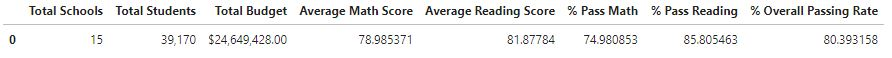
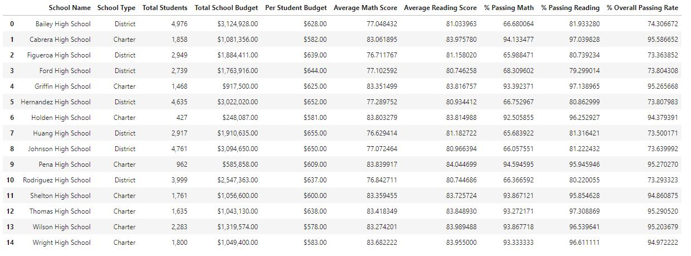
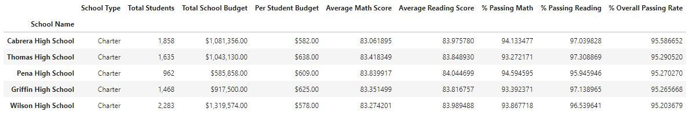
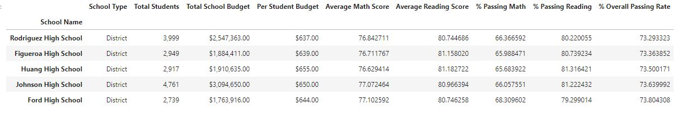
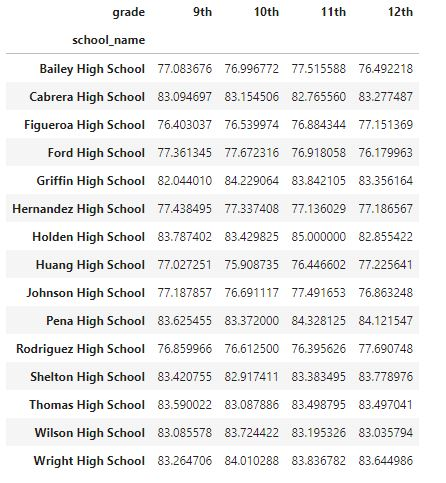
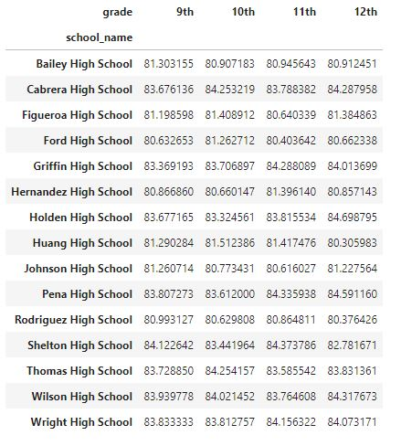
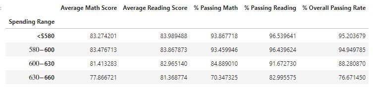
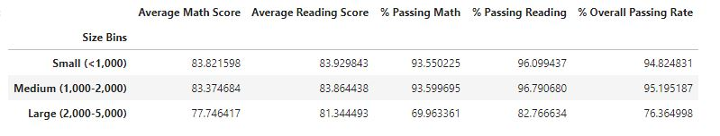
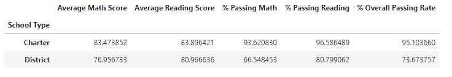

# Pandas-Challenge

## Py City Schools
In this assignment I will take on the role as Chief Data Scientist for the Py city school district. As such, I will be helping the school board and mayor make strategic decisions regarding future school budgets and priorities. My first task is to analyze district-wide standardized test results. My final report will include the following:

- District Summary

- School Summary

- Top Performing Schools (By Passing Rate)

- Bottom Performing Schools (By Passing Rate)

- Math Scores by Grade Level 

- Reading Scores by Grade Level 

- Scores by School Spending 

- Scores by School Size

- Scores by School Type 

